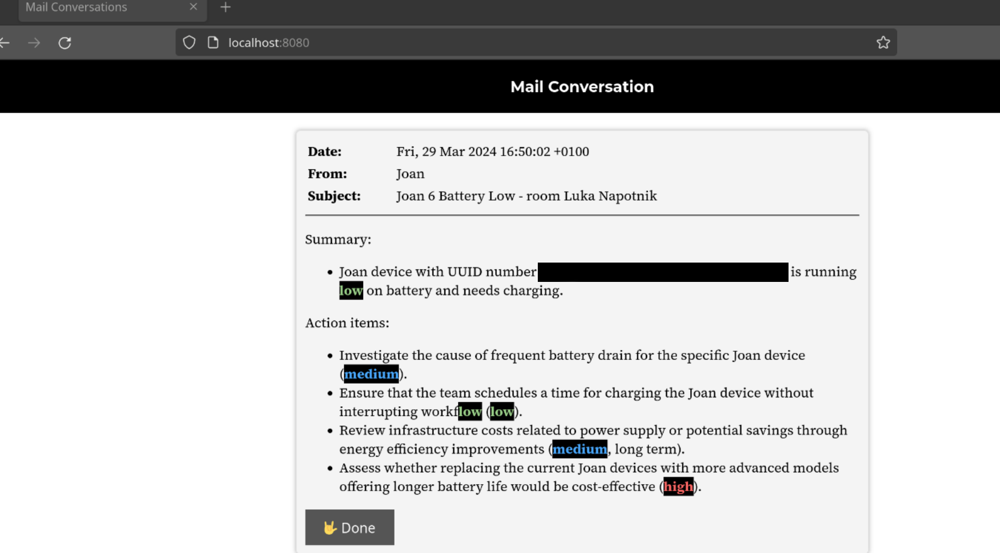

# AI-powered email assistant

This tool summarizes your emails for you, find action items and prioritizes them, according to your defined bio.

1. the tool can be privacy-aware by using a local ``ollama`` installation
2. OpenAI is supported, if you want better LLM functionality
3. the tool has a nice web UI

## The Code

1. because of abstractions, it is easily to add support for new LLM interfaces
2. this also applies for mail providers (only GMail is supported ATM)

## GMail authentication

If you're running this locally, Google won't be able to redirect back to the web app, once you authenticate.

You can still authenticate by copying the returned state token, once authorized to Google (the code from the URL).

## License

This tool is licensed under GNU GPL (see ).
